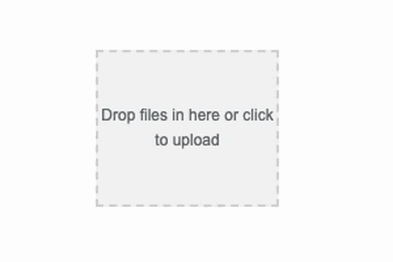
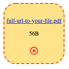

# Simple single file upload with Drag'n'Drop for Vue2 and Vue3

<a href="https://www.npmjs.com/package/@beaubus/single-file-upload-for-vue">
    
</a>

<a href="https://github.com/beaubus/single-file-upload-for-vue/blob/master/LICENSE">
    
</a>
&nbsp;&nbsp;
<a href="https://twitter.com/intent/follow?screen_name=daily_web_dev">
    
</a>

<br>
<br>

A universal, modern upload input package that supports both Vue2 and Vue3. It features Drag'n'Drop functionality and is based on the Fetch API, supporting both POST and DELETE methods. This package is simple, lightweight, and easy to use.



<a target="_blank" href="https://www.beaubus.com/packages/#single-file-upload-for-vue">Demo</a>

## Installation

NPM
```bash
npm i @beaubus/single-file-upload-for-vue
```

CDN
```bash
<script src="https://unpkg.com/@beaubus/single-file-upload-for-vue/dist/min.js"></script>
```

## Usage
```js
import single_file_upload_for_vue from '@beaubus/single-file-upload-for-vue';

components: {
    'single-file-upload-for-vue': single_file_upload_for_vue
}
```

Wrap component with `<div>` as it takes all the space:
```html
<div style="width: 120px; height: 120px">
    <single-file-upload-for-vue
        name="name_of_the_file_input"
        store_url="/url-to-backend-store"
        destroy_url="/url-to-backend-destroy"
        :headers="{'Accept': 'application/json'}"
        :loaded="{url: 'https://full-url-to-your-file.pdf', size: 56}"
        @complete="uploadComplete"
    ></single-file-upload-for-vue>
</div>
```

### Backend

On the server side, you should handle POST and DELETE requests. DELETE url would have the file name at the end.

| Request            | Return                 
| ---                | ---                     
| POST               |  `{url: 'full-url', size: 0}`   
| DELETE             |  `{result: true}`

#### Laravel example:
```php
// routes/web.php

Route::post('/upload', 'PrintableInvoicesController@uploadCustomInvoice');
Route::delete('/destroy/{file_name}', 'PrintableInvoicesController@destroyCustomInvoice');


// PrintableInvoicesController.php

public function uploadCustomInvoice(Request $request): array
{
    $path = $request->custom_invoice_file->store('folder');
    $url = asset('storage/' . $path);

    return [
        'url' => $url,
        'size' => \Storage::size($path),
    ];
}


public function destroyCustomInvoice(string $file_name): array
{
    return [
        'result' => \Storage::delete('folder/' . $file_name)
    ];
}
```


## Styling



Increase specificity and style it as you need:
```css
div > .single-file-upload-for-vue {
    font-size: .75em;
    border: 2px dashed #dc5f00;
    background: #ffe484;
    border-radius: 20%;
}
```

## Properties
| Name         | Type    | Default        | Description                                        
| ---          | ---     | ---            | ---                                                
| name         | String  | 'file_input'   | Name of the file input
| store_url    | String  | '/store-url'   | url for the POST request                                
| destroy_url  | String  | '/destroy-url' | url for the DELETE request (file name would be appended to the end)
| headers      | Object  |                | Request headers
| loaded       | Object  |                | Absolute link to the loaded file (url) and size in bytes (size) 
| accept       | String  |                | A comma-separated list of one or more file types, or unique file type specifiers, describing which file types to allow


## Emits
| Name               | Description              | Payload
| ---                | ---                      | --- 
| complete           | Upload complete event    | Absolute link to the uploaded file and size in bytes: {url: 'link', size: 7}


## License
The MIT License (MIT). Please see [License File](LICENSE) for more information.


