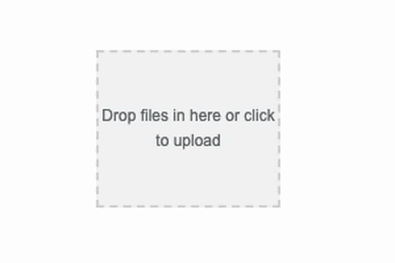

# Simple single file upload with Drag'n'Drop for Vue2

<a href="https://twitter.com/intent/follow?screen_name=daily_web_dev">
    
</a>

<br>
<br>

Modern upload input with Drag'n'Drop support, based on the Fetch Api (POST and DELETE methods). As simple and lightweight as possible.



## Installation

Install the plugin from npm
```bash
npm i @beaubus/single-file-upload-for-vue
```

## Usage
Wrap component with <div> as it takes all the space:
```html
<div style="width:120px;height:120px">
    <single-file-upload-for-vue :headers="{'Accept': 'application/json'}"
                                :loaded="{url: 'https://full-url-to-your-file.pdf', size: 56}"
                                store_url="/relative-url-to-backend-store"
                                destroy_url="/relative-url-to-backend-destroy"
                                @complete="uploadComplete"
    ></single-file-upload-for-vue>
</div>
```

