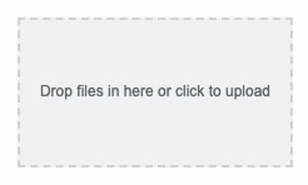

# Simple single file upload with Drag'n'Drop for Vue2

<a href="https://www.npmjs.com/package/@beaubus/single-file-upload-for-vue">
    
</a>

<a href="https://github.com/beaubus/single-file-upload-for-vue/blob/master/LICENSE">
    
</a>
&nbsp;&nbsp;
<a href="https://twitter.com/intent/follow?screen_name=daily_web_dev">
    
</a>

<br>
<br>

Modern upload input with Drag'n'Drop support, based on the Fetch Api (POST and DELETE methods). As simple and lightweight as possible.



## Installation

NPM
```bash
npm i @beaubus/single-file-upload-for-vue
```

CDN
```bash
<script src="https://unpkg.com/@beaubus/single-file-upload-for-vue/dist/single-file-upload-for-vue.min.js"></script>
```

## Usage
```js
import single_file_upload_for_vue from '@beaubus/single-file-upload-for-vue';

components: {
    'single-file-upload-for-vue': single_file_upload_for_vue
}
```

Wrap component with `<div>` as it takes all the space:
```html
<div style="width: 120px; height: 120px">
    <single-file-upload-for-vue
        name="name_of_the_file_input"
        store_url="/url-to-backend-store"
        destroy_url="/url-to-backend-destroy"
        :headers="{'Accept': 'application/json'}"
        :loaded="{url: 'https://full-url-to-your-file.pdf', size: 56}"
        @complete="uploadComplete"
    ></single-file-upload-for-vue>
</div>
```

### Backend

On the server side you shoud handle POST and DELETE requests.


## Styling


Increase specificity and style it as you need:
```css
div > .single-file-upload-for-vue {
    font-size: .75em;
    border: 2px dashed #dc5f00;
    background: #ffe484;
    border-radius: 20%;
}
```

## Properties
| Name         | Type    | Default        | Description                                        
| ---          | ---     | ---            | ---                                                
| name         | String  | 'file_input'   | Name of the file input
| store_url    | String  | '/store-url'   | url for the POST request                                
| destroy_url  | String  | '/destroy-url' | url for the DELETE request (file name would be appended to the end)
| headers      | Object  |                | Request headers
| loaded       | Object  |                | Absolute link to the loaded file (url) and size in bytes (size) 


## Emits
| Name               | Description              | Payload
| ---                | ---                      | --- 
| complete           | Upload complete event    | Absolute link to the uploaded file and size in bytes: {url: 'link', size: 7}


## License
The MIT License (MIT). Please see [License File](LICENSE) for more information.


